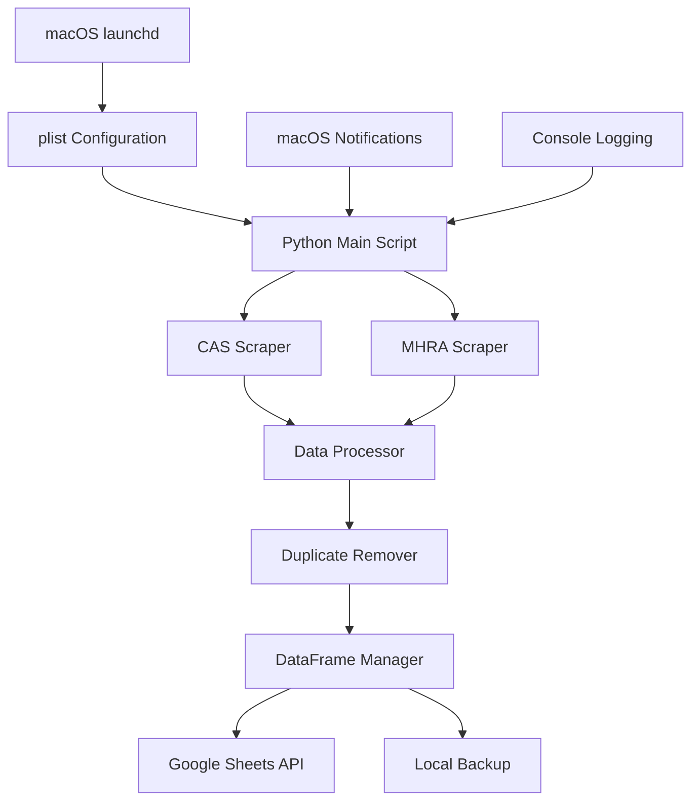

# CAS Alert Scraper - Project Plan

## Project Overview

### Objective
Design and implement an automated system to scrape CAS (Central Alerting System) alerts from two UK government websites, process the data, remove duplicates, and maintain an up-to-date Google Sheets database. The system will run daily on macOS using native automation.

### Target Websites
1. **CAS MHRA**: https://www.cas.mhra.gov.uk/SearchAlerts.aspx
2. **GOV.UK Drug/Device Alerts**: https://www.gov.uk/drug-device-alerts

### Key Requirements
- Daily automated scraping
- Duplicate detection and removal
- Google Sheets integration
- macOS native automation using plist files
- Error handling and notifications
- Data persistence and backup

## Architecture Overview



## Technical Analysis

### Website Analysis

#### CAS MHRA Site
- **Technology**: ASP.NET with JavaScript postback
- **Challenges**: ViewState management, pagination handling
- **Data Structure**: Reference, Alert Title, Originated By, Issue Date, Status
- **Pagination**: 10 results per page with postback navigation

#### GOV.UK Site
- **Technology**: Modern GOV.UK framework
- **Advantages**: Clean HTML structure, RESTful design
- **Data Structure**: Rich metadata including medical specialties
- **Volume**: 1,284+ messages with filtering capabilities

### Data Model

```python
@dataclass
class Alert:
    reference: str
    title: str
    originator: str
    issue_date: datetime
    status: str
    alert_type: str
    source: str  # 'CAS' or 'GOVUK'
    url: str
    medical_specialty: Optional[str]
    scraped_at: datetime
    hash_id: str  # For duplicate detection
```

## Implementation Plan

### Phase 1: Core Infrastructure

#### Dependencies
```
requests>=2.31.0
beautifulsoup4>=4.12.0
pandas>=2.0.0
gspread>=5.10.0
google-auth>=2.22.0
python-dotenv>=1.0.0
loguru>=0.7.0
keyring>=24.0.0
lxml>=4.9.0
```

#### Base Classes
```python
class BaseScraper:
    - handle_request_errors()
    - parse_date()
    - clean_text()
    - save_raw_data()
    - rate_limit()

class CASMHRAScraper(BaseScraper):
    - handle_viewstate()
    - navigate_pagination()
    - parse_alert_table()

class GOVUKScraper(BaseScraper):
    - parse_alert_list()
    - extract_alert_details()
    - handle_pagination()
```

### Phase 2: Data Processing

#### Duplicate Detection Strategy
1. **Primary**: Compare by reference number
2. **Secondary**: Title similarity using fuzzy matching
3. **Tertiary**: Date and content hash comparison

```python
class DuplicateManager:
    - generate_content_hash()
    - compare_references()
    - fuzzy_match_titles()
    - merge_duplicate_records()
```

#### Data Standardization
```python
class DataProcessor:
    - normalize_dates()
    - standardize_alert_types()
    - extract_metadata()
    - validate_required_fields()
    - generate_unique_ids()
```

### Phase 3: Storage & Integration

#### Google Sheets Integration
```python
class GoogleSheetsManager:
    - authenticate_service_account()
    - create_worksheet_if_not_exists()
    - batch_update_data()
    - format_headers_and_columns()
    - add_conditional_formatting()
    - backup_existing_data()
```

#### Local Data Management
```python
class DataFrameManager:
    - load_existing_data()
    - append_new_alerts()
    - remove_duplicates()
    - sort_by_date()
    - export_to_csv_backup()
    - validate_data_integrity()
```

### Phase 4: macOS Automation

#### Launch Agent Configuration
**File**: `~/Library/LaunchAgents/com.cas-alert.scraper.plist`

```xml
<?xml version="1.0" encoding="UTF-8"?>
<!DOCTYPE plist PUBLIC "-//Apple//DTD PLIST 1.0//EN" "http://www.apple.com/DTDs/PropertyList-1.0.dtd">
<plist version="1.0">
<dict>
    <key>Label</key>
    <string>com.cas-alert.scraper</string>

    <key>ProgramArguments</key>
    <array>
        <string>/usr/bin/python3</string>
        <string>/path/to/project/src/cas_alert/main.py</string>
    </array>

    <key>StartCalendarInterval</key>
    <dict>
        <key>Hour</key>
        <integer>9</integer>
        <key>Minute</key>
        <integer>0</integer>
    </dict>

    <key>StandardOutPath</key>
    <string>/Users/username/Library/Logs/cas-alert-scraper.log</string>

    <key>StandardErrorPath</key>
    <string>/Users/username/Library/Logs/cas-alert-scraper-error.log</string>

    <key>WorkingDirectory</key>
    <string>/path/to/project</string>

    <key>EnvironmentVariables</key>
    <dict>
        <key>PATH</key>
        <string>/usr/local/bin:/usr/bin:/bin</string>
    </dict>

    <key>RunAtLoad</key>
    <false/>

    <key>KeepAlive</key>
    <false/>
</dict>
</plist>
```

#### macOS Integration Features

**Native Notifications**
```python
class MacOSNotifier:
    @staticmethod
    def send_notification(title, message, sound=True):
        cmd = ['osascript', '-e', f'display notification "{message}" with title "{title}"']
        if sound:
            cmd.extend(['-e', 'beep'])
        subprocess.run(cmd)
```

**Keychain Integration**
```python
class MacOSCredentialManager:
    @staticmethod
    def store_google_credentials(credentials_json):
        keyring.set_password("cas-alert", "google-sheets", credentials_json)

    @staticmethod
    def get_google_credentials():
        return keyring.get_password("cas-alert", "google-sheets")
```

**Console Logging**
```python
class MacOSLogger:
    def __init__(self):
        syslog.openlog("cas-alert-scraper")

    def log_info(self, message):
        syslog.syslog(syslog.LOG_INFO, message)

    def log_error(self, message):
        syslog.syslog(syslog.LOG_ERR, message)
```

## Project Structure

```
cas-alert/
├── README.md
├── plan.md
├── setup.py
├── requirements.txt
├── .env.example
├── .gitignore
├── automation/
│   ├── com.cas-alert.scraper.plist
│   ├── install.sh
│   ├── uninstall.sh
│   └── README.md
├── src/cas_alert/
│   ├── __init__.py
│   ├── main.py
│   ├── config/
│   │   ├── __init__.py
│   │   └── settings.py
│   ├── scrapers/
│   │   ├── __init__.py
│   │   ├── base.py
│   │   ├── cas_mhra.py
│   │   └── govuk.py
│   ├── data/
│   │   ├── __init__.py
│   │   ├── models.py
│   │   ├── processor.py
│   │   └── duplicates.py
│   ├── storage/
│   │   ├── __init__.py
│   │   ├── dataframe_manager.py
│   │   └── google_sheets.py
│   ├── macos/
│   │   ├── __init__.py
│   │   ├── notifications.py
│   │   ├── credentials.py
│   │   └── logging.py
│   └── utils/
│       ├── __init__.py
│       └── helpers.py
├── tests/
│   ├── __init__.py
│   ├── test_scrapers.py
│   ├── test_data_processing.py
│   └── test_integration.py
├── data/
│   ├── backups/
│   └── .gitkeep
└── logs/
    └── .gitkeep
```

## Configuration

### Environment Variables (.env)
```bash
# Google Sheets Configuration
GOOGLE_SHEETS_CREDENTIALS_PATH=/Users/username/.config/cas-alert/credentials.json
GOOGLE_SHEET_ID=your_google_sheet_id_here
GOOGLE_WORKSHEET_NAME=CAS_Alerts

# Scraping Configuration
SCRAPE_DELAY_SECONDS=2
MAX_RETRIES=3
TIMEOUT_SECONDS=30
USER_AGENT=CAS-Alert-Scraper/1.0

# Data Processing
DUPLICATE_THRESHOLD=0.85
MAX_ALERTS_PER_RUN=1000
BACKUP_ENABLED=true

# macOS Specific
ENABLE_NOTIFICATIONS=true
LOG_TO_CONSOLE=true
NOTIFICATION_SOUND=true

# Logging
LOG_LEVEL=INFO
LOG_RETENTION_DAYS=30
```

### Google Sheets Setup
1. Create Google Cloud Project
2. Enable Google Sheets API
3. Create Service Account
4. Download credentials JSON
5. Share target Google Sheet with service account email
6. Store credentials securely using macOS Keychain

## Installation & Management

### Installation Script (install.sh)
```bash
#!/bin/bash
set -e

echo "Installing CAS Alert Scraper..."

# Install Python dependencies
pip3 install -r requirements.txt

# Create necessary directories
mkdir -p ~/Library/Logs
mkdir -p ~/Library/LaunchAgents
mkdir -p ~/.config/cas-alert

# Copy and configure plist file
cp automation/com.cas-alert.scraper.plist ~/Library/LaunchAgents/
sed -i '' "s|/path/to/project|$(pwd)|g" ~/Library/LaunchAgents/com.cas-alert.scraper.plist
sed -i '' "s|username|$(whoami)|g" ~/Library/LaunchAgents/com.cas-alert.scraper.plist

# Load the launch agent
launchctl load ~/Library/LaunchAgents/com.cas-alert.scraper.plist

echo "Installation complete!"
echo "The scraper will run daily at 9:00 AM"
echo "Logs: ~/Library/Logs/cas-alert-scraper.log"
```

### Management Commands
```bash
# Check status
launchctl list | grep cas-alert

# View logs
tail -f ~/Library/Logs/cas-alert-scraper.log

# Manual run (testing)
launchctl start com.cas-alert.scraper

# Stop/Start
launchctl stop com.cas-alert.scraper
launchctl start com.cas-alert.scraper

# Uninstall
./automation/uninstall.sh
```

## Error Handling & Monitoring

### Error Categories
1. **Network Errors**: Timeouts, connection failures
2. **Parsing Errors**: Website structure changes
3. **Data Errors**: Invalid dates, missing fields
4. **Storage Errors**: Google Sheets API limits, authentication
5. **System Errors**: File permissions, disk space

### Monitoring Strategy
- macOS native notifications for critical errors
- Detailed logging to Console.app
- Email alerts for repeated failures (optional)
- Data integrity checks after each run

### Recovery Procedures
```python
class ErrorRecovery:
    - retry_with_exponential_backoff()
    - fallback_to_cached_data()
    - send_admin_notification()
    - graceful_degradation()
```

## Security Considerations

### Credential Management
- Use macOS Keychain for sensitive data
- Service account for Google Sheets (no user OAuth)
- Environment variables for non-sensitive config
- Secure file permissions on config files

### Rate Limiting
- Respectful scraping with delays
- User-Agent identification
- Robots.txt compliance
- Circuit breaker pattern for failures

## Testing Strategy

### Unit Tests
- Individual scraper functionality
- Data processing and deduplication
- Google Sheets integration
- macOS notification system

### Integration Tests
- End-to-end scraping workflow
- Error handling scenarios
- Data consistency checks
- Performance benchmarks

### Manual Testing
- Website structure validation
- Google Sheets formatting
- macOS automation testing
- Notification delivery

## Future Enhancements

### Phase 2 Features
- Streamlit dashboard for data visualization
- Advanced filtering and search capabilities
- Historical trend analysis
- Export to multiple formats

### Potential Additions
- Additional data sources
- Machine learning for alert categorization
- API endpoint for external access
- Mobile notifications via Pushover/Slack

## Maintenance Schedule

### Daily
- Automated scraping and data updates
- Log rotation and cleanup

### Weekly
- Review error logs and performance metrics
- Validate data integrity

### Monthly
- Update dependencies
- Review and optimize scraping patterns
- Backup configuration and data

### Quarterly
- Website structure validation
- Security audit of credentials
- Performance optimization review

## Troubleshooting Guide

### Common Issues

**Scraper Not Running**
1. Check launchctl status: `launchctl list | grep cas-alert`
2. Verify plist file permissions
3. Check Python path and dependencies

**No New Data**
1. Verify website accessibility
2. Check for website structure changes
3. Review scraping logs for errors

**Google Sheets Not Updating**
1. Verify service account permissions
2. Check API quotas and limits
3. Validate credentials and sheet ID

**Missing Notifications**
1. Check notification permissions
2. Verify osascript functionality
3. Review notification settings

### Log Analysis
```bash
# View recent logs
tail -100 ~/Library/Logs/cas-alert-scraper.log

# Search for errors
grep -i error ~/Library/Logs/cas-alert-scraper.log

# Monitor real-time
tail -f ~/Library/Logs/cas-alert-scraper.log
```

## Success Metrics

### Key Performance Indicators
- **Uptime**: >99% successful daily runs
- **Data Quality**: <1% duplicate rate
- **Latency**: New alerts detected within 24 hours
- **Reliability**: <5% false positive rate

### Monitoring Dashboard (Future)
- Daily scraping success rate
- Number of new alerts found
- Data processing time
- Google Sheets update status
- Error frequency and types

---

*This plan serves as the master reference for the CAS Alert Scraper project. Update this document as the project evolves and new requirements emerge.*
